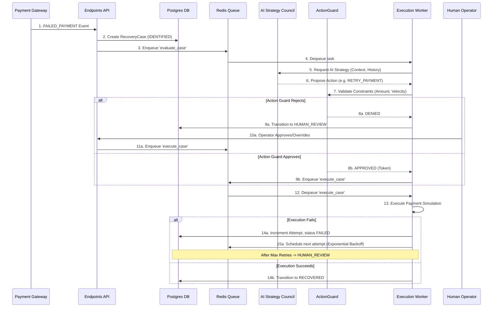
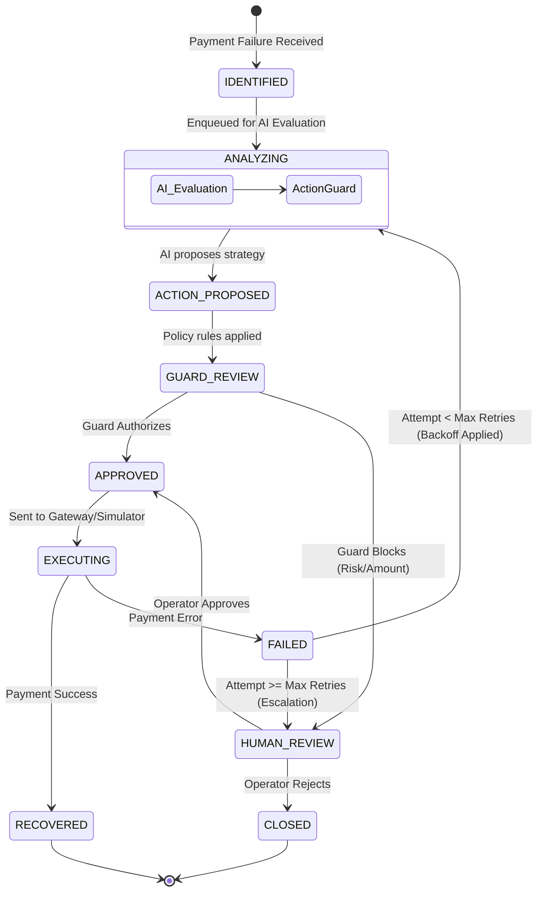

# RecoverAI Backend Engine

FastAPI-based payment recovery orchestrator, safety enforcement policy engine, and transaction state machine.

## Features
- **ActionGuard Engine**: Deterministic policy validation enforcing merchant rules (limits, amounts, retries).
- **Security Authorization Tokens**: Issues single-use execution tokens.
- **Redis Integration**: Caches real-time cases and metric summaries, invalidates cache dynamically on updates, and locks execution for idempotency.
- **PostgreSQL Database**: Persistent transaction logs and audit trail storage.

## Getting Started

### Prerequisites
- Python 3.11
- PostgreSQL & Redis

### Setup & Run
1. Create virtual environment and install dependencies:
   ```bash
   python -m venv .venv
   source .venv/bin/activate
   pip install -r requirements.txt
   ```
2. Start the development API server:
   ```bash
   uvicorn app.main:app --host 0.0.0.0 --port 8000 --reload
   ```
3. Run tests:
   ```bash
   pytest
   ```

## Workflow Architecture

The following sequence diagram illustrates how a failed payment event travels through the various microservices, AI layers, and deterministic guards.



## State Machine

Every `RecoveryCase` follows a strict state machine. Below is the state transition diagram detailing the lifecycle of a single case from identification to resolution.



## Detailed Component Explanation

The backend operates as the deterministic brain and state manager of the RecoverAI ecosystem. While the `ai-service` handles subjective playbook reasoning, this backend guarantees execution safety, enforces policies, and orchestrates the distributed workflow.

### 1. The Worker Node (`worker.py`)
- Acts as a background asynchronous task consumer listening to a Redis Queue.
- It pulls newly created `RecoveryCase`s from the `IDENTIFIED` state and sends their context to the external `ai-service` for evaluation.
- Implements an **Exponential Backoff Scheduler**: When an execution fails, the worker calculates a dynamic delay (e.g., `(2 ^ attempt) * base_delay`) and re-enqueues the evaluation task for the future.

### 2. ActionGuard Engine (`action_guard.py`)
- The AI proposes actions, but the ActionGuard acts as a zero-trust policy enforcer.
- It intercepts the AI's `ACTION_PROPOSED` state and cross-references it with hard business limits from the PostgreSQL database (e.g., Maximum retry attempts, Maximum amount limits like ₹5000).
- If an action passes, ActionGuard issues a cryptographically secure, single-use `authorization_token` (UUID). Without this token, the `ExecutionSimulator` will forcefully block the execution.

### 3. Execution Simulator (`executor.py` & `gateway.py`)
- An abstraction layer over actual payment gateways (like Razorpay) and internal simulated mocks.
- It checks the `authorization_token` provided by the ActionGuard.
- Features **Idempotency Execution Registry**: It prevents double-charging by caching successful executions in-memory. If the same `action_id` is processed again, it safely returns the cached success response. However, it intelligently bypasses the cache for failed states, allowing the retry loop to correctly test the payment endpoint again.

### 4. Human Operator Escalations (`endpoints.py`)
- The backend API exposes endpoints for a human operator to override AI failures.
- If a case fails 3 times, or the ActionGuard blocks an action due to high risk, the state machine halts at `HUMAN_REVIEW`.
- An operator can review the AI's audit trail and submit an override (`APPROVE`, `REJECT`, `CLOSE`). The backend API intercepts this, generates an `override-` or `FAIL-` token, and bypasses the ActionGuard to immediately trigger the Execution Worker.
